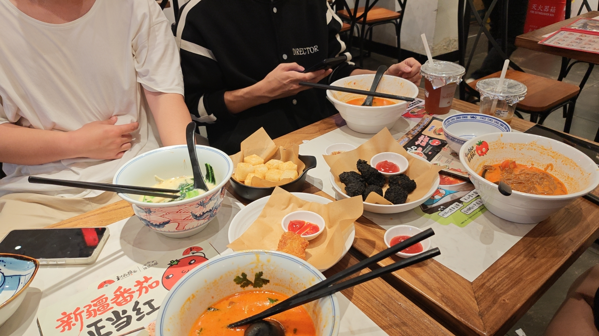

# 前言
当时是本着公费旅游的想法随便去看看的来着，还真没想到能拿奖。 
我看大部分都是大专生，就我们是中专的（当时直接给我吓不行了）
# 美食😋
不管了先炫再说

（好贵 还好有报销）
# 比赛
work这决赛题咋比初赛题简单啊，侥幸拿下四个Flag 
我的队友一人一个Flag（+20分）直接给我们队伍干到第三了，真有点没想到 
~~当时快结束了掉第五了~~ 
比赛的细节就不一一赘述了，因为手上没有赛题与witeup，没办法在我的博客上再解析解题步骤了。

# 结尾
其实这篇文章写的很水，我的时间不多，一个月差不多只有3-4天休息，除了在学校上课我还有自己的博客与项目要维护，时间不是很充足 
大家应该也看出来了我文笔很差，但我还是像给大家分享一下日常，我技术性文章可能会很久才更一次，毕竟时间很难抽出来 
下次给大家分享一下我与业余无线电的故事

## **==敬请期待==**